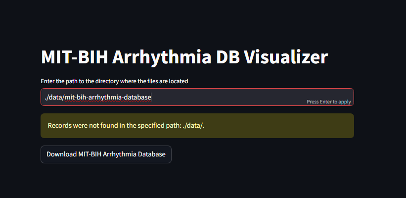
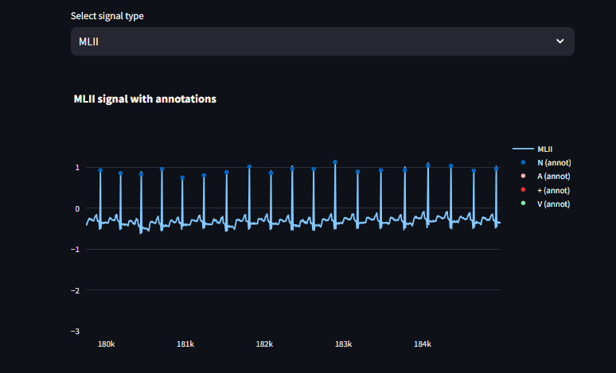

# MIT-BIH Arrhythmia DB Visualizer

This project provides a visualizer for the **MIT-BIH Arrhythmia Database**, allowing users to view ECG signal data alongside their respective annotations. The tool offers interactive data exploration, including statistical summaries, annotation distributions, and plots of signals with annotation markers.

## Features

- **ECG Signal Visualization**: View ECG signals with annotations from the MIT-BIH Arrhythmia Database.
- **Interactive Graphs**: Display signal traces, annotation distribution (bar chart, pie chart), and time-series signals with annotation markers.
- **Detailed Statistics**: Analyze the number and types of annotations, including beat and non-beat annotations.
- **Download the Database**: [Download the MIT-BIH Arrhythmia Database](https://physionet.org/physiobank/database/mitdb/) to access the ECG signals and annotations.

## Screenshots

- **Download to a folder**
<div align="center">
  
</div>

- **ECG Signal Visualization**
<div align="center">
  
</div>

## Getting Started

### Prerequisites

Ensure that Python 3.7+ is installed on your system. You will also need to install the required dependencies.

## Getting Started

1. Clone the repository:
    ```sh
    git clone git@github.com:MateusjsSilva/MIT-BIH-Arrhythmia-DB-Visualizer.git
    cd MIT-BIH-Arrhythmia-DB-Visualizer
    ```

2. **Create a virtual environment**:
    ```sh
    python -m venv venv
    ```

3. **Activate the virtual environment**:
    - On Windows:
        ```sh
        venv\Scripts\activate
        ```
    - On macOS/Linux:
        ```sh
        source venv/bin/activate
        ```

4. **Install the required Python packages**:
    ```sh
    pip install -r requirements.txt
    ```

### Running the Visualizer

1. **Prepare the MIT-BIH Arrhythmia Database files**:
   - Place your `.dat`, `.hea`, and `.atr` files from the **MIT-BIH Arrhythmia Database** into a directory (e.g., `./data/mit-bih-arrhythmia-database`).

2. **Launch the Streamlit application**:
    ```sh
    streamlit run .\src\visualizer.py
    ```

3. You will be prompted to enter the path where your MIT-BIH files are located and then select a record to visualize.

### Usage

Once the visualizer is running, you can interact with the following features:

- **Signal Overview:** View detailed information about the signals in the selected record, including frequency, units, and available comments.
- **Annotations:** See all annotations in the record, with counts of beat and non-beat annotations and their corresponding definitions.
- **Statistics:** Graphical breakdown of annotation counts and percentages, displayed in bar and pie charts.
- **Signal Plotting:** Select a specific signal from the record and visualize it alongside its annotations.

## Contribution

Feel free to open issues or submit pull requests. All contributions are welcome!

## License

This project is licensed under the MIT License - see the [LICENSE](LICENSE) file for details.